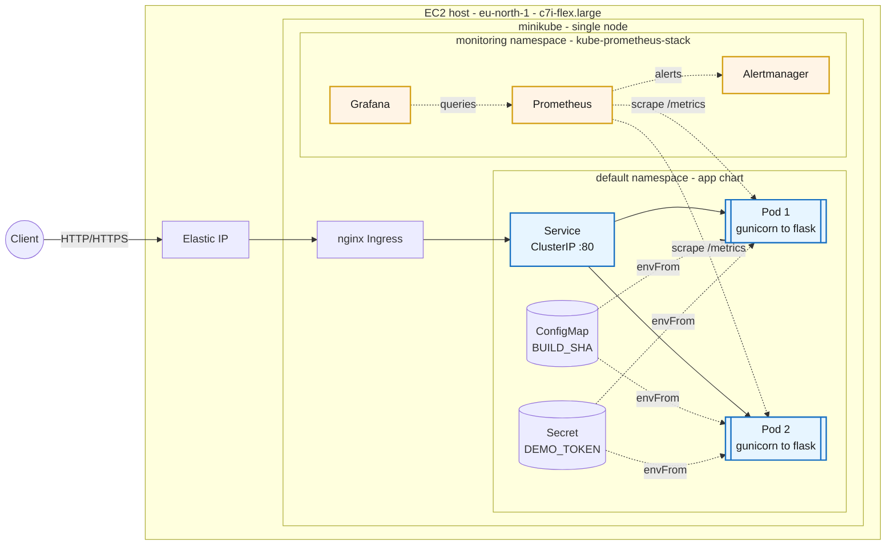

# devops-case — InsiderOne DevOps Internship Case Study 2026

A small HTTP service shipped end-to-end like production: container → Kubernetes (Helm) → CI/CD → observability → public URL.

> **About this doc**: `README.md` is the public-facing how-to and rationale — the steady-state guide for anyone landing on the repo cold. For *live* project state — checklist of done/pending tasks, the numbered decision log with alternatives explicitly considered, the working-directory tree, and the open-questions list — see [`PROGRESS.md`](./PROGRESS.md). When the two diverge on a decision, PROGRESS is the authoritative log; README is the polished prose.

## Track

**Track A — Minikube on EC2.** See [`SETUP.md`](./SETUP.md) for the full infra setup log (EC2 type, security group, software install).

## The service

A minimal Flask service exposing three endpoints:

| Method | Path | Returns |
|--------|------|---------|
| GET | `/ping` | `pong` (text/plain) |
| GET | `/healthz` | `{"status":"ok"}` — used by Kubernetes probes |
| GET | `/version` | `{"sha":"<BUILD_SHA>"}` — the SHA the image was built from |
| GET | `/metrics` | Prometheus exposition format — request counter and latency histogram (Day 4) |

Every request receives an `X-Request-ID` response header. If the request
carries one in, it's echoed back; otherwise a fresh UUID4 hex is generated.
The same value is included in the JSON access log line for that request.

### Environment variables

See [`.env.example`](./.env.example).

| Variable | Default | Purpose |
|----------|---------|---------|
| `PORT` | `8080` | Port the service listens on |
| `BUILD_SHA` | `dev` | Returned by `/version`; set to the git commit SHA at image build time |
| `LOG_LEVEL` | `INFO` | Root logger level (`DEBUG`, `INFO`, `WARNING`, `ERROR`) |
| `PROMETHEUS_MULTIPROC_DIR` | `/tmp/prometheus_multiproc` (set in the image) | Where `prometheus_client` writes per-worker mmap files. Don't override unless you also mount a writable path there. |
| `WEB_CONCURRENCY` | `2` | Gunicorn worker count (read by `gunicorn.conf.py`) |

## Running locally

### Option 1 — Python directly

```bash
python3 -m venv .venv
source .venv/bin/activate
pip install -r requirements.txt
python app.py
```

### Option 2 — Docker

```bash
docker build -t devops-case-app:local .
docker run --rm -p 8080:8080 -e BUILD_SHA=$(git rev-parse --short HEAD) devops-case-app:local
```

### Option 3 — docker-compose

```bash
BUILD_SHA=$(git rev-parse --short HEAD) docker compose up --build
```

### Verify

```bash
curl localhost:8080/ping     # → pong
curl localhost:8080/healthz  # → {"status":"ok"}
curl localhost:8080/version  # → {"sha":"..."}
```

## Container details

- Multi-stage build: `python:3.12-slim` builder → `python:3.12-slim` runtime
- Runs as non-root `appuser` (uid 1000) with `/usr/sbin/nologin`
- `HEALTHCHECK` uses Python stdlib (no curl/wget shipped in the image)
- Entrypoint: `gunicorn -c gunicorn.conf.py app:app` — the config file pins
  bind/workers, disables gunicorn's plaintext access log (Flask emits a
  JSON one), and wires the `prometheus_client` multiprocess cleanup hook
- `/tmp/prometheus_multiproc` is created and chowned to `appuser` in the
  image for the multiprocess metric files (see [Observability](#observability))

## Architecture



The diagram is rendered inline by GitHub. The blue nodes are the application
(`Service`, two pods running `gunicorn` → `flask`); the orange nodes are the
observability overlay added on Day 4.2. Dashed arrows are *information flow*
(scrape, envFrom, alerts, queries); solid arrows are *request flow*.

> **One implementation detail not shown in the diagram for clarity:** with
> minikube's docker driver, the cluster's ingress doesn't bind directly to
> the EC2 host's port 80 — it listens inside the minikube docker network
> (`192.168.49.2:80`). A host-level `socat` forwarder packaged as a
> systemd unit (`minikube-ingress-proxy.service`) bridges `EC2:80` to
> `192.168.49.2:80`, so the Elastic IP serves traffic as expected.
> Conceptually the request path is `EIP → host:80 → socat → minikube
> ingress → Service → Pod`. See `SETUP.md` "Phase 4" for the full
> rationale and `PROGRESS.md` decision #39 for the alternatives
> considered.

**How the layers landed:**

- **Day 1** — the app (Flask + gunicorn), its container, the repo hygiene.
- **Day 2** — the Helm chart wraps Deployment / Service / Ingress /
  ConfigMap / Secret around the container.
- **Day 3** — CI/CD pipeline builds and publishes the image to GHCR,
  scans with Trivy, and (3.4) auto-deploys to the cluster via OIDC + SSM
  after every merge to `main`.
- **Day 4.1** — the app emits JSON logs to stdout and exposes
  `/metrics` in Prometheus exposition format (`http_requests_total`
  Counter, `http_request_duration_seconds` Histogram).
- **Day 4.2** — `kube-prometheus-stack` installed in the `monitoring`
  namespace; the app chart ships a `ServiceMonitor` so Prometheus
  scrapes both pods, a `PrometheusRule` (`HighErrorRate`), and a
  labelled `ConfigMap` carrying the Grafana dashboard.
- **Day 4.3** — the EC2, EIP, and SG from Day 0 are codified in
  OpenTofu (`infra/`); `tofu plan` is empty against the live
  infrastructure.

For operational guidance see [`RUNBOOK.md`](./RUNBOOK.md). For the
security model see [`SECURITY.md`](./SECURITY.md). For the major
architectural decisions, see [`docs/adr/`](./docs/adr/).

## Kubernetes (Helm)

The service is packaged as a Helm chart at [`charts/app/`](./charts/app), with two environment overlays.

### Chart layout

```
charts/app/
├── Chart.yaml                  # name app, version 0.1.0, appVersion "0.1.0"
├── values.yaml                 # prod-shaped defaults with inline rationale
├── values-dev.yaml             # dev overlay (1 replica, dev host)
├── values-prod.yaml            # explicit prod overlay (2 replicas, prod host)
└── templates/
    ├── deployment.yaml         # probes on /healthz, envFrom ConfigMap+Secret, security context
    ├── service.yaml            # ClusterIP, port 80 → container 8080
    ├── ingress.yaml            # nginx class, host from values
    ├── configmap.yaml          # BUILD_SHA
    ├── secret.yaml             # DEMO_TOKEN placeholder, supplied at deploy time
    ├── serviceaccount.yaml
    ├── _helpers.tpl
    ├── NOTES.txt
    └── tests/test-connection.yaml
```

Scaffolded from `helm create`, then trimmed (removed bundled `hpa.yaml` and `httproute.yaml`) and customized.

### Environments

Two env overlays. The only intentional differences:

| Field | `values-dev.yaml` | `values-prod.yaml` |
|---|---|---|
| `replicaCount` | 1 | 2 |
| `ingress.hosts[0].host` | `devops-case.dev.local` | `devops-case.local` |

Everything else (resources, probes, security context, image, ConfigMap/Secret wiring) is intentionally identical so both environments exercise the same shape. Resources don't diverge because EC2 only has 4 GiB RAM — over-divergence at this scale would be theatrical. A real cluster would push prod limits higher.

Verify the rendered diff is exactly those two lines:

```bash
helm template app charts/app -f charts/app/values-dev.yaml  > /tmp/dev.yaml
helm template app charts/app -f charts/app/values-prod.yaml > /tmp/prod.yaml
diff /tmp/dev.yaml /tmp/prod.yaml
```

### Probes

Both probes hit `/healthz` (the existing app endpoint), with different timings:

| Probe | initialDelay | period | timeout | failureThreshold |
|---|---|---|---|---|
| **liveness** | 5 s | 10 s | 2 s | 3 |
| **readiness** | 2 s | 5 s | 2 s | 2 |

Liveness uses a longer interval so a transient hiccup doesn't restart the container; readiness is tighter so a stalled pod is pulled from the Service's endpoints quickly without killing it. Both target the named pod port `http` (8080).

### Resources

Per-container, applied to every replica in every env:

|  | requests | limits |
|---|---|---|
| **cpu** | 100m | 500m |
| **memory** | 128Mi | 256Mi |

Reasoning:

- **`requests: cpu 100m / mem 128Mi`** — sized for steady-state idle. Python + venv + 2 gunicorn workers sit at roughly that footprint at zero traffic.
- **`limits: cpu 500m`** — ~5× burst headroom so a brief request flood doesn't get CPU-throttled. CPU is compressible, so the limit isn't enforced as harshly as memory.
- **`limits: memory 256Mi`** — ~2× the request. Python worker memory tends to stay stable at the worker count, so the limit only needs slack to absorb one-shot allocations (e.g. logging a large payload). Going higher would waste cluster capacity on EC2's 4 GiB.

### Deploying

On a cluster where minikube + the nginx ingress addon are already running (see [`SETUP.md`](./SETUP.md)):

```bash
# Day 2 image strategy: build inside minikube's Docker daemon so the cluster
# can pull locally (no registry yet — GHCR push lands on Day 3).
eval $(minikube docker-env)
docker build --build-arg BUILD_SHA=$(git rev-parse --short HEAD) \
             -t devops-case-app:0.1.0 .

# Dev install
helm upgrade --install app charts/app -f charts/app/values-dev.yaml \
  --set config.BUILD_SHA=$(git rev-parse --short HEAD) \
  --set-string secret.DEMO_TOKEN=$(openssl rand -hex 16)

# Prod install (same release name; helm upgrades the running release)
helm upgrade --install app charts/app -f charts/app/values-prod.yaml \
  --set config.BUILD_SHA=$(git rev-parse --short HEAD) \
  --set-string secret.DEMO_TOKEN=$(openssl rand -hex 16)

kubectl rollout status deployment/app
kubectl get pods,svc,ingress
```

To reach the service through the ingress on minikube, add the host to `/etc/hosts`:

```bash
echo "$(minikube ip) devops-case.dev.local" | sudo tee -a /etc/hosts
curl http://devops-case.dev.local/ping        # → pong
```

### Rollout & rollback

Image-tag bumps and rollback go through standard Helm commands:

```bash
docker build --build-arg BUILD_SHA=$(git rev-parse --short HEAD) -t devops-case-app:0.1.1 .

helm upgrade app charts/app -f charts/app/values-prod.yaml \
  --reuse-values --set image.tag=0.1.1
kubectl rollout status deployment/app
helm history app                              # rev 1, 2, 3

helm rollback app                              # back to the previous revision
kubectl rollout status deployment/app
helm history app                              # rev 4 description: "Rollback to 2"
```

The `CHART` and `APP VERSION` columns in `helm history` track `Chart.yaml`'s `version`/`appVersion`, not the image tag. The image tag is what actually rolls — confirm with `kubectl get deployment app -o jsonpath='{.spec.template.spec.containers[0].image}'`.

Evidence for the Day 2 checkpoint (dev install, prod install, resources applied, rollout, rollback) lives in [`daily-checkpoints/day2-checkpoint.pdf`](./daily-checkpoints/day2-checkpoint.pdf).

## CI/CD

GitHub Actions workflow at [`.github/workflows/ci.yml`](./.github/workflows/ci.yml). Runs on pull request, push to `main`, push to `v*` tags, and `workflow_dispatch`.

### Jobs

| Job | Purpose | Gates `build`? |
|---|---|---|
| `lint (ruff)` | Style, import order, common bug patterns (`E`, `F`, `I`, `B`, `UP` rule set) | Yes |
| `test (pytest)` | 3 unit tests across `/ping`, `/healthz`, `/version` | Yes |
| `gitleaks (secret scan)` | Full git history scanned for credential patterns; output `--redact`ed | Yes |
| `aws OIDC (whoami)` | Assumes an IAM role via OIDC, runs `aws sts get-caller-identity` | No — informational |
| `build, scan, push` | Build image → Trivy gate (CRITICAL/HIGH, `--ignore-unfixed`) → conditional push to GHCR | — |

### Image tag scheme

`docker/metadata-action` produces tags depending on the event:

| Event | Tags pushed to GHCR |
|---|---|
| Pull request | none — built and scanned locally, never pushed |
| Push to `main` | `:main`, `:<short-sha>` |
| Push to `v0.1.0` tag | `:0.1.0`, `:latest` |

`:latest` only tracks released versions, not the tip of `main`. Main commits get pinned via `:<short-sha>` instead. The chart's `appVersion` is kept aligned with the released git tag.

### Secret & vulnerability scanning

Both `gitleaks` and `trivy` are installed as binaries (`curl | tar -xz`) instead of using the official wrapper actions. Two different reasons converged on the same approach:

- `gitleaks/gitleaks-action@v2` requires a paid `GITLEAKS_LICENSE` env var for org accounts. Personal accounts are free today, but the licensing model has wobbled.
- `aquasecurity/trivy-action` and `aquasecurity/setup-trivy` both do an internal sparse-checkout of the `aquasecurity/trivy` repo (to grab `contrib/` templates). That partial clone uses `--filter=blob:none` and creates a "promisor remote" for lazy blob fetches — which intermittently fails on hosted runners with `could not read Username for 'https://github.com': terminal prompts disabled`. We hit it once during 3.3; the same workflow turned green on re-run with no code change. Skipping the wrapper bypasses the bug entirely.

Trade-off: binary versions are pinned in the workflow file (`GITLEAKS_VERSION=8.30.1`, `TRIVY_VERSION=0.70.0`) and must be bumped manually instead of inherited from the action's defaults.

### AWS OIDC (no long-lived credentials)

The `aws OIDC (whoami)` job proves the federation works on every run: GitHub mints a short-lived OIDC token, AWS exchanges it for temporary credentials via `sts:AssumeRoleWithWebIdentity`. No AWS access keys exist anywhere in the repo or in CI secrets.

The role's trust policy is scoped to `repo:ayberksavas/devops-case:*` — only workflows running from this specific repo can assume it. The role has **no permission policies attached** yet; `sts:GetCallerIdentity` works without any. Day 3.4 will add `ssm:SendCommand` for the auto-deploy path.

One-time AWS-side setup (manual for now; Day 4 IaC will codify it):

```bash
# OIDC identity provider for GitHub (one per AWS account)
aws iam create-open-id-connect-provider \
  --url https://token.actions.githubusercontent.com \
  --client-id-list sts.amazonaws.com \
  --thumbprint-list 6938fd4d98bab03faadb97b34396831e3780aea1

# Role with trust policy file://trust-policy.json scoped to repo:ayberksavas/devops-case:*
aws iam create-role \
  --role-name github-actions-devops-case \
  --assume-role-policy-document file://trust-policy.json
```

The role ARN and AWS region live as repo **variables** (not secrets), since they're identifiers, not credential material:

```bash
gh variable set AWS_ROLE_ARN --body "arn:aws:iam::<ACCOUNT_ID>:role/github-actions-devops-case"
gh variable set AWS_REGION   --body "eu-north-1"
```

### Release flow

`CHANGELOG.md` follows the [Keep a Changelog](https://keepachangelog.com/en/1.1.0/) format. Cutting a release:

1. Update `CHANGELOG.md` — move entries from `[Unreleased]` into a dated `[X.Y.Z]` section. PR → merge → delete branch.
2. Tag the merge commit on `main`:
   ```bash
   git tag -a vX.Y.Z -m "vX.Y.Z — short summary"
   git push origin vX.Y.Z
   ```
3. The tag push fires the workflow with `github.ref_type == 'tag'`, which builds → scans → publishes `:<version>` and `:latest` to GHCR.
4. Create the GitHub Release:
   ```bash
   awk '/^## \[X\.Y\.Z\]/{f=1;next} /^## \[/{f=0} f' CHANGELOG.md > /tmp/notes.md
   gh release create vX.Y.Z --title "vX.Y.Z — short summary" --notes-file /tmp/notes.md
   ```

The chart's `appVersion`, the git tag, and the published image tag should all stay aligned.

### Auto-deploy on merge

A push to `main` that passes `build, scan, push` is then auto-deployed to the minikube cluster on EC2 by the `deploy (ssm → ec2 → helm)` job. Mechanism:

1. The workflow assumes the same OIDC role from 3.2 — now extended with an inline `DeployViaSSM` policy granting `ssm:SendCommand` scoped to one document (`AWS-RunShellScript`) and one instance (the EC2 host).
2. `aws ssm send-command` invokes a shell script on the EC2 instance as the `ubuntu` user. The command line is small: `cd /opt/devops-case && git fetch && git reset --hard origin/main && bash scripts/deploy.sh <short-sha>`.
3. [`scripts/deploy.sh`](./scripts/deploy.sh) runs `helm upgrade --install` with `--set image.tag=<short-sha>` and `--set config.BUILD_SHA=<short-sha>` so `/version` reports the deployed SHA, then waits for `kubectl rollout status`.
4. The workflow polls with `aws ssm wait command-executed`, then always prints the captured stdout/stderr (so failed deploys are debuggable).

**Why this shape (vs ArgoCD/Flux GitOps):**

| | CI push via OIDC + SSM (chosen) | ArgoCD/Flux |
|---|---|---|
| Extra cluster components | none | ~500 MiB on the 4 GiB EC2 |
| Reuses what we built | yes — extends the OIDC role | no — net new control plane |
| Feedback latency | merge → ~30s | merge → next sync cycle |
| Rollback model | imperative (`helm rollback`) | declarative (revert the commit) |
| Right shape at this scale | ✅ one app, one node | overkill |

GitOps becomes the right answer in a multi-app, multi-team context. For one Flask app on a single-node minikube with the OIDC machinery already in place, the CI-push path is the simpler, less wasteful pick.

**One-time AWS-side prerequisites** (done manually for now; Day 4 IaC will codify it):

- EC2 instance profile `devops-case-ec2-ssm` attached to the instance, with the AWS-managed `AmazonSSMManagedInstanceCore` policy — lets the SSM agent register the instance.
- Inline policy `DeployViaSSM` attached to the OIDC role with `ssm:SendCommand` (scoped to `AWS-RunShellScript` + the instance ARN) and `ssm:GetCommandInvocation`.
- Repo variables: `EC2_INSTANCE_ID` (in addition to `AWS_ROLE_ARN`, `AWS_REGION` from 3.2).
- The repo is cloned once at `/opt/devops-case` on EC2, owned by `ubuntu`. Subsequent deploys `git fetch && reset --hard origin/main`.

## Observability

### Structured JSON logs

The app emits one JSON object per log line on stdout. A custom
`JsonFormatter` (stdlib `logging`, no extra dep) covers the fields the
case study asks for plus a few that are useful in practice:

```json
{
  "timestamp": "2026-05-24T08:33:07.228Z",
  "level": "INFO",
  "msg": "request",
  "request_id": "869983147f8d48678d5dd10a696cdd26",
  "method": "GET",
  "path": "/ping",
  "status": 200,
  "duration_ms": 0.08
}
```

`path` is the *matched URL rule* (`/ping`, `/healthz`, `/version`,
`/metrics`), not the raw request path — so an unknown URL with arbitrary
noise can't blow up log/metric cardinality.

Gunicorn's own access log is disabled in `gunicorn.conf.py`; the Flask
`after_request` hook is the single source of access lines.

### `/metrics` endpoint

Two application metrics in Prometheus exposition format, in addition to
the default Python process metrics:

| Metric | Type | Labels |
|---|---|---|
| `http_requests_total` | Counter | `method`, `path`, `status` |
| `http_request_duration_seconds` | Histogram | `method`, `path` |

The `/metrics` endpoint itself is excluded from the counters, so a
Prometheus scrape doesn't bias its own series.

### Multiprocess metrics with gunicorn

Gunicorn runs 2 workers. Each worker keeps its own in-memory metric
state — so without coordination, a scrape would hit one worker at random
and report flickering totals. The standard fix is `prometheus_client`'s
multiprocess mode:

- `PROMETHEUS_MULTIPROC_DIR=/tmp/prometheus_multiproc` is set in the
  image; each worker writes its counters to an mmap file there.
- `gunicorn.conf.py`'s `child_exit` hook calls
  `prometheus_client.multiprocess.mark_process_dead(worker.pid)` so a
  gone worker's file is no longer aggregated as live.
- The `/metrics` handler instantiates a fresh `CollectorRegistry` per
  request and adds a `MultiProcessCollector` that reads every worker's
  file and sums them.
- In Kubernetes, the chart mounts an `emptyDir` (`medium: Memory`, 16Mi)
  on top of `/tmp/prometheus_multiproc`. `emptyDir` resets with the pod,
  which is the desired behaviour: a rollout = a clean counter slate.

### Local verification

```bash
# In one shell — start gunicorn with multiproc enabled
mkdir -p /tmp/prom_local
PROMETHEUS_MULTIPROC_DIR=/tmp/prom_local \
  gunicorn -c gunicorn.conf.py app:app

# In another shell
for i in $(seq 1 10); do curl -sS http://127.0.0.1:8080/ping >/dev/null; done
curl -sS http://127.0.0.1:8080/metrics | grep -E '^http_'
```

The `http_requests_total{...path="/ping"...}` line should sum to 10
across both workers.

### Prometheus + Grafana (Day 4.2)

The cluster-side observability stack is **kube-prometheus-stack** — the
upstream Helm chart from `prometheus-community` that bundles Prometheus,
Alertmanager, Grafana, the Prometheus operator, kube-state-metrics, and
node-exporter into a single install.

#### Installing the stack

```bash
# Run from the repo root on the cluster host
bash scripts/install-monitoring.sh
```

The script is idempotent (`helm upgrade --install`), creates the
`monitoring` namespace, and pins the chart at version `65.5.0`. Override
with `CHART_VERSION=… bash scripts/install-monitoring.sh` to bump
deliberately.

#### Slim profile — why each knob

The EC2 host has 4 GiB RAM and runs minikube + the app + Linux on top.
A default kube-prometheus-stack install reserves around 2 GiB for
Prometheus alone, which would OOM the host. `monitoring/values.yaml`
trims each component to fit; every override is annotated in-file.
Headlines:

| Component | What changed | Why |
|---|---|---|
| Prometheus | 250Mi req / 600Mi limit, retention `2d`, `emptyDir` storage | Default 2GB+ doesn't fit. 2d retention is enough to see a working day's trends. `emptyDir` means a pod restart resets history — acceptable on a demo. |
| Selectors | `serviceMonitorSelectorNilUsesHelmValues: false` (and same for PodMonitor / Rule / Probe) | Default behaviour is to filter on `release: <release-name>` labels, which would silently drop our app's `ServiceMonitor`. Disabling the filter lets any SM in any namespace be picked up. |
| Alertmanager | 32Mi req / 64Mi limit, 24h retention | Same RAM story; demo cluster doesn't need long history. |
| Grafana | 80Mi req / 192Mi limit, persistence off, `adminPassword: admin` | Reached only via `kubectl port-forward`. No persistent dashboards beyond what we provision. Admin password is annotated as demo-only. |
| Control-plane scraping | `kubeControllerManager`, `kubeScheduler`, `kubeProxy`, `kubeEtcd` all disabled | Minikube doesn't expose these endpoints externally. Default install would generate noisy "target down" alerts. |
| Default rules | Same four `rules.*` flipped off | Removes the alert definitions whose targets we just disabled. |

#### How the app gets scraped

Three resources, all rendered conditionally by `monitoring.enabled`:

| Template | Purpose |
|---|---|
| `charts/app/templates/servicemonitor.yaml` | Tells the operator to scrape the app's `Service` on port `http` at `/metrics`, every 15s. |
| `charts/app/templates/prometheusrule.yaml` | One alert (`HighErrorRate`) — 5xx ratio over 1m > 5% for 5m, with a `> 0` guard against div-by-zero. |
| `charts/app/templates/dashboard-configmap.yaml` | Wraps `charts/app/dashboards/app-overview.json` in a `ConfigMap` carrying the `grafana_dashboard: "1"` label. Grafana's sidecar (set to `searchNamespace: ALL`) auto-discovers it. |

`monitoring.enabled` defaults to `false` in `values.yaml` so the chart
installs on a fresh cluster before the stack's CRDs exist;
`values-prod.yaml` flips it to `true`.

#### Install ordering

The chart's monitoring templates reference CRDs
(`ServiceMonitor`, `PrometheusRule`) shipped by kube-prometheus-stack.
**Install the stack before deploying the app with `monitoring.enabled: true`**
or `helm install` will fail with `no matches for kind "ServiceMonitor"`.

When making changes via CI:

1. SSH to EC2, `git checkout` the branch, `bash scripts/install-monitoring.sh` (one-time).
2. Merge the PR → auto-deploy lays down the monitoring resources, which the operator picks up.

#### Verifying on the cluster

```bash
# Operator picked up the ServiceMonitor and rule
kubectl get servicemonitor,prometheusrule -l app.kubernetes.io/name=app
# expect: one of each

# Prometheus is scraping both app pods
kubectl -n monitoring port-forward svc/kps-kube-prometheus-stack-prometheus 9090:9090 &
curl -sS http://localhost:9090/api/v1/targets \
  | python3 -c "import sys,json; [print(t['labels']['job'], t['labels'].get('pod',''), t['health']) for t in json.load(sys.stdin)['data']['activeTargets'] if t['labels'].get('job') == 'app']"
# expect: two lines, both 'up'

# Alert is loaded
curl -sS http://localhost:9090/api/v1/rules | grep -o '"name":"HighErrorRate"'
```

For Grafana, port-forward (and SSH-tunnel from your laptop if you're on EC2):

```bash
# On the cluster host
kubectl -n monitoring port-forward svc/kps-grafana 3000:80

# From your laptop (in another terminal)
ssh -i devops-case.pem -L 3000:localhost:3000 -L 9090:localhost:9090 ubuntu@<EIP>
```

Then open `http://localhost:3000` (admin / admin) → Dashboards → "App overview".

#### Why port-forward, not a public ingress

Grafana on this stack has `adminPassword: admin` and no other auth in
front of it. Exposing it through nginx-ingress would mean leaking an
unauthenticated dashboard on the internet. The port-forward + SSH tunnel
pattern means access is gated by EC2 SSH keys, which already exist and
already enforce a per-IP allowlist on the security group.

## Infrastructure as Code (Day 4.3)

The Day 0 AWS surface (EC2, Elastic IP, security group) is described in
OpenTofu / Terraform configuration under [`infra/`](./infra). The PDF
explicitly scopes Day 4.3 to *"defining the EC2, EIP, and security group
with Terraform or OpenTofu"*; that's exactly what this directory does.
IAM resources from Day 3 (OIDC provider, role, instance profile,
`DeployViaSSM` inline policy) remain documented manual setup — codifying
them was an explicit option but adds defense surface with no PDF
requirement.

### File layout

```
infra/
├── versions.tf                 # required_version >= 1.5, aws ~> 5.70 provider pin
├── variables.tf                # region, instance_type, ami_id, ssh_allowed_cidr, ...
├── main.tf                     # data.aws_vpc.default + SG + EC2 + EIP
├── outputs.tf                  # instance_id, public_ip, security_group_id
├── terraform.tfvars.example    # committed; the real terraform.tfvars is gitignored
├── .gitignore                  # .terraform/, *.tfstate*, terraform.tfvars
└── .terraform.lock.hcl         # provider version pin (committed so installs are reproducible)
```

### Tool: OpenTofu (not Terraform)

OpenTofu is the open-source fork of Terraform under the Linux Foundation,
created after Hashicorp re-licensed Terraform under the BUSL in 2023. The
HCL syntax is identical — every file in `infra/` works unchanged with
either `tofu` or `terraform` CLIs. For a personal project there's no
reason to depend on a BUSL-licensed binary when the community fork is
drop-in compatible.

### Install OpenTofu

```bash
# Ubuntu (EC2)
curl --proto '=https' --tlsv1.2 -fsSL https://get.opentofu.org/install-opentofu.sh \
  | sudo sh -s -- --install-method deb

# macOS
brew install opentofu
```

### Why `import`, not `apply`

The EC2, EIP, and SG already exist (created manually on Day 0). Running
`tofu apply` against a fresh configuration would *try to create new
resources* — there's no `apply --adopt` flag. The correct flow is
`tofu import` to bring the live resources into Terraform's local state
without changing AWS, then iterate on the `.tf` files until `tofu plan`
shows no changes.

`scripts/terraform-import.sh` automates this for the 3 resources. It
is idempotent — re-running on already-imported resources is a no-op.

### Import + reconcile

```bash
# 1. Fill in the two required values (file is gitignored)
cd infra
cp terraform.tfvars.example terraform.tfvars
#   edit terraform.tfvars: ami_id (from the running EC2) and ssh_allowed_cidr
#                          (your home /32; can be read from the live SG)

# 2. Initialise the working directory
tofu init
cd ..

# 3. Discover IDs (from a machine with AWS creds + ec2:Describe* permissions)
EC2_INSTANCE_ID=$(aws ec2 describe-instances --region eu-north-1 \
  --filters 'Name=tag:Name,Values=devops-case' 'Name=instance-state-name,Values=running' \
  --query 'Reservations[].Instances[].InstanceId' --output text)
EIP_ALLOC=$(aws ec2 describe-addresses --region eu-north-1 \
  --query "Addresses[?InstanceId=='$EC2_INSTANCE_ID'].AllocationId" --output text)
SG_ID=$(aws ec2 describe-instances --region eu-north-1 \
  --instance-ids "$EC2_INSTANCE_ID" \
  --query 'Reservations[].Instances[].SecurityGroups[].GroupId' --output text)

# 4. Import
EC2_INSTANCE_ID="$EC2_INSTANCE_ID" EIP_ALLOC="$EIP_ALLOC" SG_ID="$SG_ID" \
  bash scripts/terraform-import.sh

# 5. Plan + apply (apply was needed once to align metadata; see "Why apply was needed once" below)
cd infra && tofu plan
tofu apply

# 6. Verify the IaC is now a faithful description of reality
tofu plan
# expect: "No changes. Your infrastructure matches the configuration."
```

### Why `apply` was needed once

After import, `tofu plan` showed three small metadata diffs:

1. **EIP** — no tags on the live resource; `main.tf` declares `Name` and
   `Project` tags.
2. **EC2** — `Project` tag missing; live had only `Name`.
3. **SG** — egress and ingress rules had empty descriptions; `main.tf`
   declares human-readable ones (`"SSH from home"`, `"HTTP - public ingress to minikube"`, etc).

These are all in-place metadata updates — no destroys, no recreates, no
rule changes (SG rule revoke+authorize during description updates is
transparent to existing TCP connections). One `tofu apply` aligned live
to config; subsequent `tofu plan` is empty.

### Quirks worth knowing

- **`aws_eip_association` does not work for VPC EIPs** in the modern AWS
  provider (errors with *"with the retirement of EC2-Classic standard
  domain EC2 EIPs are no longer supported"* at import time). The
  workaround used here is to bind the EIP to the instance's primary
  network interface directly on the `aws_eip` resource:
  `network_interface = aws_instance.minikube.primary_network_interface_id`.
- **SG name `launch-wizard-3`** — the SG was created by the EC2 launch
  wizard on Day 0 and got the auto-generated name. `main.tf` matches it
  rather than renaming, because renaming a SG is a destroy/recreate,
  which would detach from the running EC2 (network outage). Cosmetic
  cleanup, not worth the risk on a live host.
- **`lifecycle.ignore_changes = [ami]` on the EC2** — guards against an
  accidental host recreation if `var.ami_id` ever drifts. A recreate
  would destroy minikube state, the `/opt/devops-case` checkout, and
  the SSM-managed deploy plumbing. Human action required for AMI
  changes.
- **`lifecycle.ignore_changes = [description, tags, tags_all]` on the SG** —
  the SG description is immutable in AWS (can't be changed without
  recreating the SG); tags are also ignored so the chart stays
  intentionally hands-off after the initial alignment apply.
- **Local state, no S3 backend** — single-person project; in a team
  setting state would live in S3 with a DynamoDB lock table.

### What `tofu plan` proves

A clean `tofu plan` (no changes) is the proof that the `.tf` faithfully
describes the live infrastructure. It's not a "deployment" — nothing
gets pushed. It's the "infrastructure passes its own description"
contract that you'd run before any change to know what `apply` would do.

## Project status

See [`PROGRESS.md`](./PROGRESS.md) for the live task list and day-by-day progress.

## Operations

- [`RUNBOOK.md`](./RUNBOOK.md) — one-page operator's guide. Restart, log
  access, rollback, secret rotation, common failure modes.
- [`SECURITY.md`](./SECURITY.md) — security model, secret-handling
  posture, IAM scoping, network exposure, supply chain, and a roadmap
  for production hardening.

## Architecture decisions (ADRs)

For the load-bearing decisions, full ADRs live under
[`docs/adr/`](./docs/adr/) in Michael Nygard's `Status / Context /
Decision / Consequences` format:

- [ADR 0001 — Track A: Minikube on EC2](./docs/adr/0001-track-a-minikube-on-ec2.md)
- [ADR 0002 — CI-push deploy via OIDC + SSM](./docs/adr/0002-ci-push-deploy-via-oidc-ssm.md)
- [ADR 0003 — Observability via kube-prometheus-stack (slim)](./docs/adr/0003-kube-prometheus-stack.md)

The smaller-grained numbered decision log (#1+) is in
[`PROGRESS.md`](./PROGRESS.md) — that's the authoritative list when an
ADR and a decision bullet disagree.

## Decisions (so far)

- **Why Python**: candidate familiarity. Tradeoff accepted: larger image than a Go binary.
- **Why Flask**: smallest dep footprint for three endpoints (vs FastAPI).
- **Why `python:3.12-slim`** base: balance between size and debuggability (vs distroless / alpine).
- **Why gunicorn (not `python app.py`)**: Flask's built-in server is single-threaded, has no crash recovery, and no graceful shutdown — it explicitly warns against use in production. gunicorn is a production WSGI server: it forks worker processes for real concurrency, the master process restarts crashed workers, and on `SIGTERM` it drains in-flight requests before exiting (matters for Kubernetes rolling updates on Day 2). Access logs go to stdout so `kubectl logs` works.
- **Why ruff over flake8 + black**: single binary replaces both, ~100× faster, sensible defaults out of the box, one `[tool.ruff]` block in `pyproject.toml`. ruff *format* intentionally not run yet — adds noise without value at this code size.
- **Why install gitleaks and trivy binaries directly (not via wrapper actions)**: see the [CI/CD — Secret & vulnerability scanning](#secret--vulnerability-scanning) section. Short version: gitleaks-action needs `GITLEAKS_LICENSE` for orgs, and trivy-action's internal sparse-checkout flakes on hosted runners. Binary install dodges both.
- **Why repo *variables* for AWS OIDC config (not secrets)**: `AWS_ROLE_ARN` and `AWS_REGION` are identifiers, not credential material. The entire point of OIDC is that no credential lives in repo storage — using "secrets" would falsely imply there's something to protect.
- **Why `:latest` tracks releases, not `main`**: registry convention is that `:latest` means "latest released version", not "latest commit". Main commits are addressable via `:main` and `:<short-sha>`. Setting `:latest` only on `github.ref_type == 'tag'` enforces the convention.
- **Why CI-push deploy via SSM (not ArgoCD/Flux GitOps)**: see the [Auto-deploy on merge](#auto-deploy-on-merge) table. Short version: we already built the OIDC machinery for 3.2, so deploy adds one IAM policy + one workflow job. ArgoCD is the right answer at multi-app multi-team scale; here it would add ~500 MiB on a 4 GiB EC2 plus a control plane to manage, for marginal benefit on one Flask app.
- **Why the EC2 holds a checkout of the repo at `/opt/devops-case`** (instead of CI rendering manifests and shipping them via SSM): rendered Helm output is bigger than the 4 KiB SSM inline-command limit. The alternatives are an S3 hop or compressing the YAML, both of which add moving parts. A `git fetch && reset --hard origin/main` on the EC2 is one network round-trip and keeps the deploy script tiny.
- **Why `prometheus_client` multiprocess mode (not 1 gunicorn worker, not per-worker drift)**: gunicorn runs 2 workers (production-realistic; locked on Day 1). With each worker holding its own counters, a Prometheus scrape would see flickering numbers and the Day 4.2 dashboards (RPS, error rate) would be useless. Multiprocess mode is the canonical fix — ~30 lines split across `gunicorn.conf.py` (a `child_exit` hook), an `emptyDir` volume in the chart, and one env var in the image. Dropping to 1 worker would reverse a documented prior decision and lose any concurrency story; living with drift would make the dashboards lie.
- **Why a slim kube-prometheus-stack profile (not the defaults)**: a default install reserves ~2 GiB for Prometheus alone and would OOM the 4 GiB EC2 alongside minikube + the app + Linux. The slim profile at `monitoring/values.yaml` trims Prometheus to 250Mi/600Mi req/limit, drops retention to 2 days, uses `emptyDir` instead of a PVC, and disables scraping for control-plane components minikube doesn't expose. Total stack footprint lands around 700–900 MiB, leaving plenty of headroom.
- **Why a bash install script, not a sub-chart**: `scripts/install-monitoring.sh` is the same pattern as `scripts/deploy.sh` from Day 3 — one idempotent command, version-pinned, easy to re-run. A `charts/observability/` sub-chart with kube-prometheus-stack as a dependency would buy a `Chart.lock` for version pinning but add the question *"why a chart wrapper for one external dep?"* — which doesn't have a great answer at this scale. The script is the simpler story.
- **Why monitoring resources live in the app chart (not a separate chart)**: `ServiceMonitor`, `PrometheusRule`, and the dashboard `ConfigMap` are *about the app*. Keeping them in `charts/app/templates/` with a `monitoring.enabled` flag means the chart describes the full surface of what the app deploys, and a release rolls both code and monitoring together. The flag default (`false`) lets the chart still install on a cluster that doesn't have the stack CRDs yet.
- **Why a `grafana_dashboard: "1"` ConfigMap (not a Grafana provider config)**: the kube-prometheus-stack's Grafana ships a sidecar that watches for ConfigMaps with that label across all namespaces (we set `searchNamespace: ALL`). Shipping a dashboard becomes "drop a labeled ConfigMap", with no Grafana datasource provisioning, no API tokens, no UID stability problems. The dashboard JSON lives at `charts/app/dashboards/app-overview.json` and is read into the ConfigMap via `.Files.Get`.
- **Why a div-by-zero guard on the `HighErrorRate` alert**: the alert expression is `5xx_rate / total_rate > 0.05`. On an idle service `total_rate` is 0, and `0/0` in PromQL is `NaN` — the comparison silently fails and the alert never fires. Adding `and sum(rate(http_requests_total[1m])) > 0` makes the intent explicit (only alert when there's traffic to evaluate) and avoids leaving someone wondering whether the alert is "broken" when it just hasn't seen requests.
- **Why OpenTofu over Terraform**: drop-in OSS fork under the Linux Foundation after Hashicorp re-licensed Terraform under BUSL in 2023. The HCL is identical (every file in `infra/` works with either CLI), but the BUSL license has restrictions that don't apply to OpenTofu. For a personal project there's no reason to depend on a BUSL-licensed binary when the community fork works the same way.
- **Why PDF-minimum scope for IaC (EC2/EIP/SG only, no IAM)**: the case study explicitly scopes Day 4.3 to *"defining the EC2, EIP, and security group with Terraform or OpenTofu"*. Codifying the OIDC provider, role, and `DeployViaSSM` policy from Day 3 was the alternative — it would add 4-5 more imports plus IAM surface to defend, with no PDF requirement. The IAM remains documented manual setup. Easy follow-up: import the IAM resources in a future iteration.
- **Why `tofu import` instead of `tofu apply`**: the EC2, EIP, and SG already exist from Day 0; running `apply` against a fresh configuration would try to *create new* resources alongside the live ones. The correct flow is `import` — bring the live resources into Terraform's local state without changing AWS, then iterate on the `.tf` until `plan` shows no changes. A single `apply` was needed afterwards to fill in tag and description metadata; that's the only `apply` that ran.
- **Why bind the EIP via `network_interface` on `aws_eip` instead of a separate `aws_eip_association` resource**: `aws_eip_association` has a known regression in the modern AWS provider — at import time for VPC EIPs it errors with *"with the retirement of EC2-Classic standard domain EC2 EIPs are no longer supported"*. Binding the EIP to the instance's primary network interface directly on the `aws_eip` resource (`network_interface = aws_instance.minikube.primary_network_interface_id`) avoids the broken resource and keeps the import flow to 3 resources.
- **Why `lifecycle.ignore_changes = [ami]` on the EC2**: protects the running host. If `var.ami_id` ever drifts from the live AMI, a `tofu apply` would otherwise launch a new instance and decommission the running one — destroying minikube state, the `/opt/devops-case` checkout, the SSM agent registration, and the manual install of the kube-prometheus-stack. AMI rotation needs to be an explicit human decision, not a side effect of a tfvars change.
- **Why `lifecycle.ignore_changes = [description, tags, tags_all]` on the SG**: the security group description is immutable in AWS (can't be modified without destroying and recreating the SG), so leaving it out of the diff loop avoids permanent "drift" noise. Tags are ignored for symmetry — after the initial alignment apply, the chart stays hands-off on metadata.
- **Why local state, no S3 backend**: single-person project. The case study says *"local state is fine"*. In a team setting, state would live in an S3 bucket with a DynamoDB lock table to coordinate concurrent applies — but that's overhead with no benefit at this scale.

Full ADRs land on Day 4 under `docs/adr/`.

## AI assistant disclosure

AI assistance (Claude) was used throughout development. Tooling and reasoning behind key decisions are captured in the ADRs (Day 4) and in `PROGRESS.md`.
